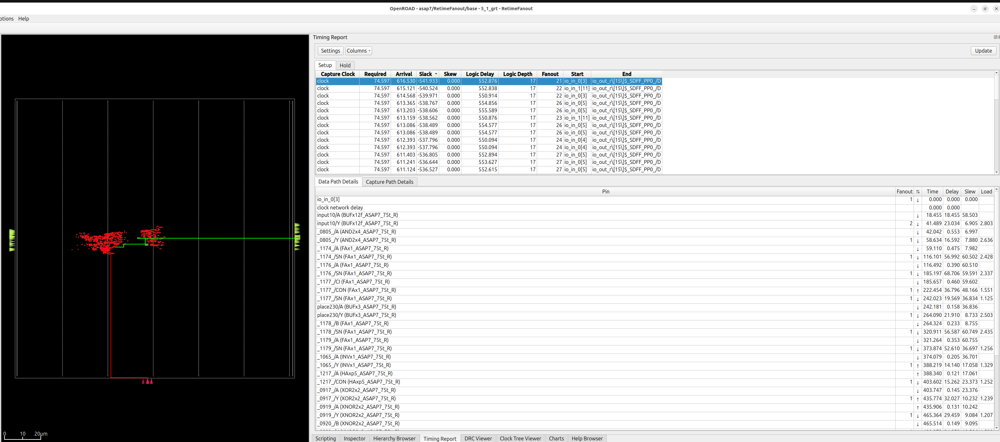

<!--
SPDX-License-Identifier: MIT
-->
# Naja Bazel OpenROAD flow

Demonstrates how to use Naja and Bazel to generate reports.

## Installation

Install [Bazelisk](https://bazel.build/install/bazelisk), Bazelisk will download all other dependencies using Bazel.

### Firtool Requirement

This project requires `firtool` (from CIRCT) to be available. Since platform-specific binaries may not be available for all systems (especially macOS), you'll need to provide a locally compiled version.

**Quick Check:** Run `./check_firtool.sh` to verify your firtool setup.

#### Option 1: Install firtool in PATH (Recommended)

1. Build CIRCT from source following the [CIRCT installation guide](https://circt.llvm.org/GettingStarted/)
2. Ensure `firtool` is available in your PATH:
   ```bash
   which firtool  # Should show the path to your firtool binary
   ```

#### Option 2: Use a specific firtool path

If you have firtool installed in a custom location, you can modify the `genverilog` rule in `BUILD.bazel` to use the specific path:

```starlark
genrule(
    name = "genverilog",
    srcs = [],
    outs = ["RetimeFanout.sv"],
    cmd = "$(execpath :generate_verilog) --firtool-binary-path /path/to/your/firtool -- --default-layer-specialization=disable -o $(location :RetimeFanout.sv)",
    tools = [
        ":generate_verilog",
    ],
)
```

#### Option 3: Use local_repository in WORKSPACE

If you prefer to reference a local CIRCT build directly:

1. Uncomment and modify the `local_repository` rule in `WORKSPACE`:
   ```starlark
   local_repository(
       name = "circt",
       path = "/path/to/your/circt/build",
   )
   ```

2. Ensure your CIRCT build directory has a `BUILD.bazel` file:
   ```starlark
   exports_files(["bin/firtool"], visibility = ["//visibility:public"])
   ```

3. Update the `genverilog` rule in `BUILD.bazel` to use the external repository:
   ```starlark
   genrule(
       name = "genverilog",
       srcs = [],
       outs = ["RetimeFanout.sv"],
       cmd = "$(execpath :generate_verilog) --firtool-binary-path $(execpath @circt//:bin/firtool) -- --default-layer-specialization=disable -o $(location :RetimeFanout.sv)",
       tools = [
           ":generate_verilog",
           "@circt//:bin/firtool",
       ],
   )
   ```

#### Building CIRCT/firtool from source

To build firtool from source:

```bash
# Clone CIRCT
git clone https://github.com/llvm/circt.git
cd circt

# Build (requires CMake and Ninja)
mkdir build && cd build
cmake -G Ninja ../llvm/llvm \
  -DLLVM_ENABLE_PROJECTS="mlir" \
  -DLLVM_EXTERNAL_PROJECTS="circt" \
  -DLLVM_EXTERNAL_CIRCT_SOURCE_DIR=.. \
  -DLLVM_ENABLE_ASSERTIONS=ON \
  -DCMAKE_BUILD_TYPE=Release

ninja firtool

# Add to PATH or copy to a directory in PATH
export PATH=$PWD/bin:$PATH
```

## Build and view design

Global route is enough to learn everything there is to learn about this example design.

To build and view example design after global route:

    bazelisk run RetimeFanout_grt /tmp/grt gui_grt



## Run naja_edit.py post synthesis and generate new netlist

The dependency of this rule is to run ORFS synthesis and pass the netlist to Naja. Naja will then read in this netlist, generate some reports and write out a new netlist. This netlist is fed into regular ORFS flow above `bazelisk run RetimeFanout_grt /tmp/grt gui_grt`

    bazelisk build naja
